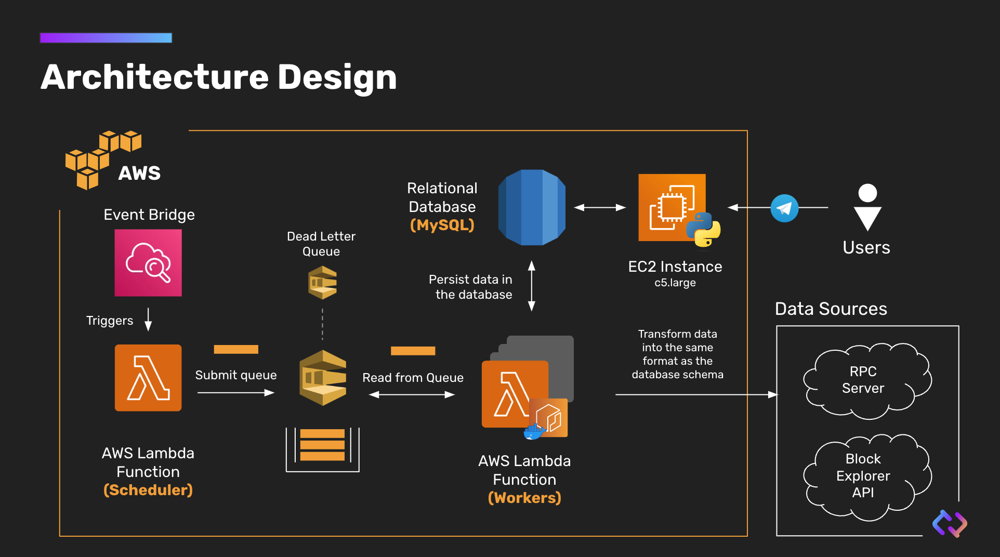

# Connext Galxe Dashboard
The script to automatically fetch Connext Liquidity transaction for it's [Liquidity Bootstraping Campaign](https://blog.connext.network/providing-liquidity-on-connext-f7aa3f2bc7b8). The

## Table of Content
- [Table of Content](#table-of-content)
- [Introduction](#introduction)
- [Architecture](#architecture)
- [Prerequisite](#prerequisite)
- [Setting up CloudWatch Event](#setting-up-cloudwatch-event)
- [Setting up RDS](#setting-up-rds)
- [Setting up SQS](#setting-up-sqs)
- [Usage](#usage)
- [1. Setup AWS CLI](#1-setup-aws-cli)
    - [1.1 Installation](#11-installation)
    - [1.2 Authrization](#12-authrization)
- [2. Create docker repository](#2-create-docker-repository)
- [3. Prepare docker image](#3-prepare-docker-image)
    - [3.1 Docker login with AWS](#31-docker-login-with-aws)
    - [3.1 Build a dockerfile](#31-build-a-dockerfile)
    - [3.2 Tag docker](#32-tag-docker)
    - [3.3 Push a docker](#33-push-a-docker)
- [4. Create a function](#4-create-a-function)
    - [4.1 Create an execution role](#41-create-an-execution-role)
    - [4.2 Create Lambda Function](#42-create-lambda-function)
- [5. Configure Environment variables](#5-configure-environment-variables)


## Architecture
For the cloud provider, we utilize AWS as it is the most popular cloud provider in the world. The architecture design is as follow:



To make the data available in real-time, we utilized CloudWatch Event to trigger the Lambda function every 5 minutes. The Lambda function will process the event and store it as a queue in AWS Simple Queue Service (SQS). Then, another Lambda function will be triggered to fetch the data from the queue and store it in AWS Relational Database Service (RDS) as a MySQL database. Note that we have 2 separate Lambda functions that will read from the queue to capture two types of events.

The first Lambda function will capture any `addSwapLiquidity` or `removeSwapLiquidity` transcation. In other word, the first lambda function will keep tracking of any mint/burn event of the Connext LP. The second Lambda function will capture all `Transfer` event. In other word, the second lambda function will keep tracking of any transfer of the Connext LP.

Both events will be stored in the same SQL database in the RDS. The schema of the database is as follow:


The data will be fetched from the following blockchain:
- Binance Smart Chain
- Optimistic Ethereum
- Polygon
- Arbitrum
- Gnosis

Note that we don't need to fetch data from Ethereum Mainnet as the Connext LP is deployed only on the above blockchain.

## Prerequisite
This section will explain the prerequisite that you need to follow before deploying the Lambda function to your AWS account.

### Setting up CloudWatch Event
1. Natigate to `CloudWatch` in your AWS account.
2. Click `Rules` in the left menu, then click `Create rule`.
3. Select `Schedule` as the event source.
4. Enter `cron(*/5 * * * ? *)` as the `Rule name`.
5. Click `Create rule`.

Note that the `cron(*/5 * * * ? *)` will trigger the Lambda function every 5 minutes.

### Setting up RDS
1. Navigate to `RDS` in your AWS account.
2. Click `Create database`.
3. Select `MySQL` as the engine.
4. Setup username and password. Also, make sure you save the username and password as you will need it later.
4. You can use the default configuration, but if you want to save cost, disable Multi-AZ and proxy.
5. Click `Create database`.

Make sure you save the `Endpoint`, `username`, and `password` as you will need it later. These information will be used when connecting to the database.

### Setting up SQS
1. Navigate to `SQS` in your AWS account.
2. Click `Create new queue`.
3. Select `FIFO` as the queue type.
4. Name the queue as you wish. Note that this queue will be used to store any transaction fetching job from the lambda server. Make sure it ends with `.fifo`.
5. Click `Create queue`.
6. Repeat the step 2-5 to create another queue. This queue will be used to store any transfers fetching job from the lambda client. Make sure it ends with `.fifo`.

Make sure you save those `Queue URL` for both queue as you will need it later.

### Setting up Lambda function that attached with CloudWatch Event
1. Navigate to `Lambda` in your AWS account.
2. Click `Create function`.
3. Select `Author from scratch`.
4. Name the function as you wish. This function will listen to the CloudWatch Event and trigger the Lambda function that will feed the data to the SQS.
5. Select `Python 3.9` as the runtime, Click `Create function`, click `Add trigger`.
6. Select `CloudWatch Events`, and choose the `Rule` that you have created in the [Setting up CloudWatch Event](#setting-up-cloudwatch-event) section.
7. Click `Add`, then click `Save`.
8. In the `Function code` section, copy the code from [lambda_cloudwatch.py](./lambda_cloudwatch.py) and paste it in the `Function code` section.
9. Click `Deploy`.

At this point, you have successfully created the Lambda function that will listen to the CloudWatch Event and trigger the Lambda function that will feed the data to the SQS. You can check if the function is working properly by looking at the `Monitoring` tab. You should see the `Invocations` increasing every 5 minutes, and your queue should have some messages in it.


## Usage
This section will explain how to deploy the Lambda function to your AWS account. Note that **you need to have an AWS account** as well as already follow the instruction in the [Prerequisite](#prerequisite) section.

### 1. Setup AWS CLI
#### 1.1 Installation
First, make sure you have installed `awscli` and `docker` in your machine. If not, follow the instruction below:
- [Install AWS CLI](https://docs.aws.amazon.com/cli/latest/userguide/cli-chap-getting-started.html)
- [Install Docker](https://docs.docker.com/engine/install/)

#### 1.2 Authrization
After installing the AWS CLI, you need to authorize it with your AWS account. To do so, follow the instruction below:
```sh
aws configure
```
Then, enter your `AWS Access Key ID` and `AWS Secret Access Key` that you can find in your AWS account. You can also specify the `Default region name` and `Default output format` if you wish.

### 2. Create docker repository
To create a docker repository, follow the instruction below:
```sh
aws ecr create-repository --repository-name <repository-name> --image-scanning-configuration scanOnPush=true --image-tag-mutability MUTABLE
```
This will create a docker repository in your AWS account. Note that you need to specify the `repository-name` and `region` in the command above.

### 3. Prepare docker image
Since our queue processor requires `gcc` to compile the cython script, we need to deploy the Lambda function with a custom docker image. To do so, follow the instruction below:
#### 3.1 Docker login with AWS
First, you need to login to your docker repository. To do so, follow the instruction below:
```sh
aws ecr get-login-password --region <region> | docker login --username AWS --password-stdin <aws-id>.dkr.ecr.<region>.amazonaws.com
```
Note that you need to specify the `region` and `aws-id` in the command above.

#### 3.1 Build a dockerfile
Then, you need to build a docker image. To do so, follow the instruction below:
```sh
docker build --platform=linux/amd64 -t <container-name> -f transactions.dockerfile .
```
Also, you need to specify the `container-name` in the command above. If you want to build the docker image for the transfers, you can use the `transfers.dockerfile` instead.

#### 3.2 Tag docker
After building the docker image, you need to tag it. To do so, follow the instruction below:
```sh
docker tag <container-name>:latest <repository-url>:latest
```
Remember to specify the `container-name` and `repository-url` in the command above.

#### 3.3 Push a docker
Finally, you need to push the docker image to the repository. To do so, follow the instruction below:
```sh
docker push <repository-url>:latest
```

### 4. Create a function
After pushing the docker image to the repository, you can create a Lambda function. To do so, follow the instruction below:
#### 4.1 Create an execution role
First, you need to create an execution role for the Lambda function. To do so, follow the instruction below:
```sh
aws iam create-role --role-name <role-name> --assume-role-policy-document '{"Version": "2012-10-17","Statement": [{ "Effect": "Allow", "Principal": {"Service": "lambda.amazonaws.com"}, "Action": "sts:AssumeRole"}]}'
```
This will create a role with the name `<role-name>` which will be used to attach the Lambda function.

#### 4.2 Create Lambda Function
Then, you need to create a Lambda function. To do so, follow the instruction below:
```sh
aws lambda create-function --function-name <lambda-function-name> --package-type Image --code ImageUri=<repository-url>:latest --role arn:aws:iam::<aws-id>:role/<role-name-from-4.1>
```
This will create a Lambda function with the name `<lambda-function-name>` and attach it to the role that you created in the previous step. Note that you need to specify the `repository-url` and `aws-id` in the command above.

### 5. Configure Environment variables
After creating the Lambda function, you need to configure the environment variables. To do so, follow the instruction below:

Configure `Environment variables` in a `Configuration` tab. Make sure to add the following variables:
- `DEBUG`: `true` if you wish the log to be verbose else `false`
- `ARBITRUMSCAN_APIKEYS`: API keys for ArbitrumScan. You can provide multiple API keys by separating them with `,`
- `BSCSCAN_APIKEYS`: API keys for BSCScan. You can provide multiple API keys by separating them with `,`
- `GNOSISSCAN_APIKEYS`: API keys for GnosisScan. You can provide multiple API keys by separating them with `,`
- `OPTIMISTICSCAN_APIKEYS`: API keys for OptimisticScan. You can provide multiple API keys by separating them with `,`
- `POLYGONSCAN_APIKEYS`: API keys for PolygonScan. You can provide multiple API keys by separating them with `,`
- `AWS_RDS_HOSTNAME`: Hostname of the RDS Database from [this section](#setting-up-rds).
- `AWS_RDS_USERNAME`: Username of the RDS Database from [this section](#setting-up-rds).
- `AWS_RDS_PASSWORD`: Password of the RDS Database from [this section](#setting-up-rds).

### 6. Configure triggers
**Repeat step 2-5 again, but for this time, you need to create another Lambda function for transfers event. Make sure you have two Lambda function for both transactions and transfers**

After configuring the environment variables, you need to configure the triggers. Since we are using SQS as the trigger, you need to create a SQS queue and configure the Lambda function to listen to the queue. To do so, follow the instruction below:
1. Navigate to the Lambda function created from step 2-5
2. Click on `Add trigger`
3. Select `SQS`
4. Select the created queued from [this section](#setting-up-sqs). If you are configuring the Lambda function for transfers, you need to select the queue that you created for transfers and vice versa.
5. Click on `Add`

Make sure both Lambda function are listening to the correct queue. At this point, you should be able to see the logs from the Lambda function.

## Fetching historical data
To fetch historical data, you need to run the `fetch_historical_data.py` script. To do so, follow the instruction below:
```sh
python scripts/fetch_historical_data.py --start-date <start-date> --end-date <end-date>
```

The start date and end date should be in the format of `YYYY-MM-DDTHH:MM:SS`. The script will fetch the data from the start date to the end date and store it in the database.

## Notes
This is the final project for 2110524 Cloud Computer Technology for Chompakorn Chaksangchaichot (6472014221).

## Author
Chompakorn Chaksangchaichot